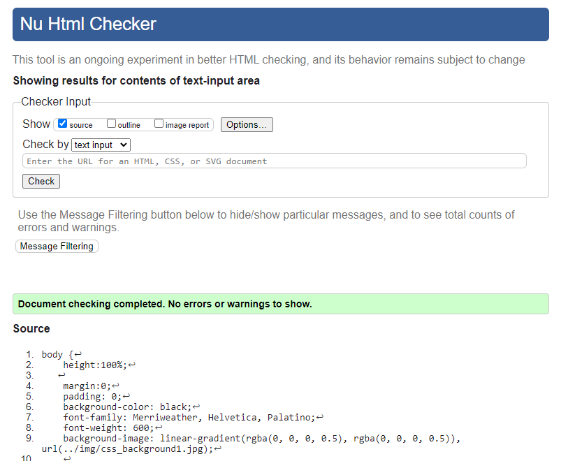

# André Landin.

## The project
This project has been created in the purpose of learning **HTML/CSS**

This is a website designed to get to know me better. 
On the site, you will find all the info you need to know in order to get to know me better.

The site includes a small introduction, a longer story page, my experience in the working life and a form where you can easily get in touch with me.

## My codes
The codes used in my HTML and CSS where designed by me, with inspiration by others as my mentor, a youtuber and some help from w3schools.com.

Must of the codes used where codes learned via Code Institute.

## My Thoughts

My thoughts about this is that I wanted to test what you can do, and I want to share a short story about me at the same time.
The power of being able to tell a story so easily by providing a link to a comlpetly personalized website as wonderful, and a great way to learn about me. 

After creating this webiste I have learned the basic foundation of how to construct a HTML and a CSS document in order to make it appealing and easily interactiv to the user. 

## My Sources
websites that I used was: w3schools.com, codeinstitute.net
The youtube video I used to design my nav buttons is: https://www.youtube.com/watch?v=ex7jGbyFgpA
Although I changed much with the codes, deleting some I didnt want, the Idea and the codes came from this tutorial.
My mentor also helped me with the first hero Image.

I am proud of this project, considering I have never done anything like this before. And never thought I could do it.

**My code, html and css had been validated through https://validator.w3.org/.**
